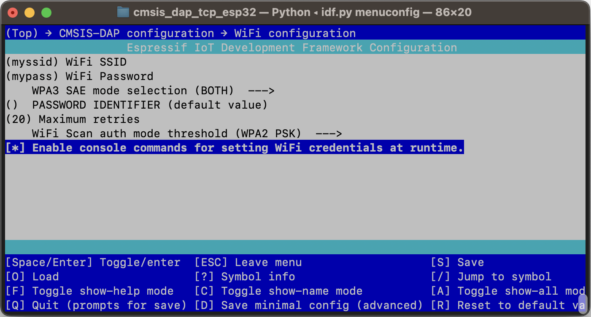

# cmsis_dap_tcp for OpenOCD

OpenOCD supports the CMSIS-DAP protocol to communicate with a JTAG / SWD
programmer. Typically this is a local programmer with a USB connection. With
the addition of the OpenOCD cmsis_dap_tcp backend, the CMSIS-DAP protocol can
now run over TCP/IP instead of USB. This allows OpenOCD to connect to a remote
programmer over the network.

This project provides the remote-side implementation of the cmsis_dap_tcp
protocol, using an ESP32 as the remote programmer. It allows a cheap ESP32
board to program and debug an ARM microcontroller target. Both JTAG and the
two-wire SWD interface are supported. OpenOCD connects to the ESP32 using
TCP/IP over WiFi, allowing remote flashing and debugging of the ARM target
board.


- Tested with the XIAO ESP32C6 development board as the programmer, and
  STM32F103 Blue Pill and Nucleo STM32F401RE as the targets.
- Either JTAG mode or SWD mode can be used to program the target. 2 GPIO are
  needed for SWD, or a minimum of 4 GPIO for JTAG.
- An optional GPIO pin can be used to drive the NRST# (SRST) signal, but this
  is typically not required.
- In JTAG mode, an optional GPIO pin can be used to drive the TRST signal, but
  this is typically not required.
- A separate GPIO may be used to control an activity LED.
- UART to TCP/IP bridge can be enabled to provide access to the target board's
  serial console remotely, using an ESP32 UART.
- Typical performance: flashing a 512 KB firmware image to the STM32F401RE
  completes in about 13.4 seconds, including erase, program, and verify (with 4
  to 8 seconds of that time used for flash erasure). The Blue Pill takes about
  6 seconds for a 64KB image. Performance also depends on the quality of your
  WiFi network.


The CMSIS-DAP code came from the Firmware directory of the [CMSIS-DAP
repo](https://github.com/ARM-software/CMSIS-DAP). ```DAP_config.h``` was then
modified to support the ESP32 GPIO.
```
commit 1fd47bed772ea40923472c90dfe11516e76033ee (HEAD -> main, tag: v2.1.2, origin/main, origin/HEAD)
```

# Limitations

The software has some limitations:

- SWO is currently unsupported.
- Maximum clock rate is about 1000 KHz (ESP32C6 configured for 160 MHz / 80 MHz).
- The WiFi credentials are hardcoded. The software must be rebuilt if you want
  to change them.

# Building and Flashing the Firmware

This code requires the ESP-IDF build tools. Refer to the official
[installation guide](https://docs.espressif.com/projects/esp-idf/en/stable/esp32/get-started/index.html#installation)
and install them first.

Activate your ESP-IDF virtual environment:

```
. $HOME/esp/esp-idf/export.sh
```

The code supports multiple different boards, and each one has its own
```sdkconfig``` file.

Choose the correct ```sdkconfig.<board_name>``` file for your board and copy it
to ```sdkconfig```. Then configure, build and flash the firmware. For example,
for the Xiao ESP32-C6 board:

```
cp sdkconfig.xiao_esp32c6 sdkconfig
idf.py fullclean menuconfig
idf.py build flash
```

In menuconfig, goto to the "CMSIS-DAP configuration" page.

* Your WiFi SSID and password can be configured on the "WiFi configuration"
  subpage.  (If you are not using WPA2, you might need to adjust the WiFi Scan
  auth mode threshold).

  
  <br><br>
  

* If needed, you can change the GPIO port pins for JTAG, SWD, reset, and LED on
  the "GPIO number assignments" subpage. The signals can be disabled if they are
  not needed.

  

* If you want to use the UART to TCP/IP bridge, it can be configured on the
  the "UART to TCP/IP bridge" subpage. (Currently, the baud rate and other
  settings cannot be changed at runtime). A script ```host/uart_bridge.sh```
  is provided that uses ```socat``` to present the remote UART as a pseudo-tty
  that can be opened using any serial terminal program on the host.

  


# Building and Running OpenOCD

Get the latest source code from git. Configure and build it as usual:

```
git clone git://git.code.sf.net/p/openocd/code openocd
cd openocd
./bootstrap
./configure
make
```

An OpenOCD configuration file has been provided for convenience.
Edit your ```tcl/interface/cmsis_dap_tcp.cfg``` configuration file to point to
your ESP32's IP address:

```
adapter driver cmsis-dap
cmsis-dap backend tcp
cmsis-dap tcp host 192.168.1.107
cmsis-dap tcp port 4441
transport select swd
reset_config none
```

If you are on a slow WiFi network, you might need to add this line to avoid
short timeouts that can lead to command mismatch errors in some cases. If so,
specify a longer timeout in milliseconds:

```
cmsis-dap tcp min_timeout 300
```

To flash an STM32 target, for example, run the following command from your
OpenOCD build directory.  Replace ```firmware.elf``` with the name of your
ELF file, and ```stm32f1x.cfg``` with the appropriate file for your
microcontroller.

```
./src/openocd --search tcl \
              -f tcl/interface/cmsis-dap-tcp.cfg \
              -f tcl/target/stm32f1x.cfg \
              -c "program firmware.elf verify reset exit"
```

# Operation

After power-on, the ESP32 will attempt to connect to the WiFi that was
configured using menuconfig. It will then begin listening for an incoming
connection from OpenOCD. The ESP32 will print status and error messages to the
console, including the WiFi connection status and IP address. A message is
printed whenever the OpenOCD client connects or disconnects. (Only one active
client is allowed).

You can run the serial monitor to view the console output. To exit the serial
monitor use ```Ctrl+]```.

```
idf.py monitor
```

Once the ESP32 has connected to WiFi and obtained an IP address by DHCP, you
can then run OpenOCD. You should see something like this from the ESP32:

```
CMSIS-DAP TCP running on ESP32
ESP-IDF version: v6.0-dev-1489-g4e036983a7
Hardware version: esp32s3 with 2 CPU core(s), WiFi/BLE, silicon revision v0.2, 2MB external flash
Minimum free heap size: 337312 bytes
Minimum free heap size: 372552 bytes
MAC address: E4B323B60EB4
Attempting to connect to WiFi SSID: 'SomeWifiRouter'
Connected to WiFi SSID: 'SomeWifiRouter'. RSSI: -75 dBm
IP address: 192.168.1.107
Disabling WiFi power savings to improve performance.
cmsis_dap_tcp: listening on port 4441.
UART bridge: remapping UART_TX = GPIO_NUM_16, UART_RX = GPIO_NUM_15.
UART bridge: listening on port 4442 for UART1.
IPv6 address (link-local): fe80:0000:0000:0000:9aa3:16ff:feec:6640
IPv6 address (global): 2406:3400:031f:ba10:9aa3:16ff:feec:6640
```

Additional debugging messages may be enabled by editing
```main/cmsis_dap_tcp.h``` and uncommenting the following line. This will
impact performance.

```
#define DEBUG_PRINTING
```

# Performance

A single SWD 32-bit transfer completes in about 45 microseconds, with an
SWCLK clock rate of approximately 1 MHz. Yellow is SWCLK. Green is SWDIO.

(TODO: the scope available at the time to make these measurements was very
limited. Redo these measurements with a better scope).


Actual performance will depend on your WiFi network. For slow networks,
you might need to increase the ```cmsis-dap tcp min_timeout``` parameter if
you see error messages related to command mismatch.

Starting the OpenOCD server like this:

```
./src/openocd \
    --search tcl \
    -c "debug_level 2" \
    -c "adapter driver cmsis-dap" \
    -c "transport select swd" \
    -c "cmsis-dap backend tcp" \
    -c "cmsis-dap tcp host 192.168.1.107" \
    -c "cmsis-dap tcp port 4441" \
    -c "cmsis-dap tcp min_timeout 150" \
    -f "tcl/target/stm32f4x.cfg" \
    -c "reset_config none"

Open On-Chip Debugger 0.12.0+dev-01114-gbf01f1089 (2025-08-07-11:52)
Licensed under GNU GPL v2
For bug reports, read
	http://openocd.org/doc/doxygen/bugs.html
Info : CMSIS-DAP: using minimum timeout of 100 ms for TCP packets.
none separate
Info : Listening on port 6666 for tcl connections
Info : Listening on port 4444 for telnet connections
Info : CMSIS-DAP: Connecting to 192.168.1.107:4441 using TCP backend
Info : CMSIS-DAP: SWD supported
Info : CMSIS-DAP: JTAG supported
Info : CMSIS-DAP: Atomic commands supported
Info : CMSIS-DAP: Test domain timer supported
Info : CMSIS-DAP: FW Version = 2.1.2
Info : CMSIS-DAP: Serial# = E4B323B60EB4
Info : CMSIS-DAP: Interface Initialised (SWD)
Info : SWCLK/TCK = 0 SWDIO/TMS = 0 TDI = 0 TDO = 0 nTRST = 0 nRESET = 1
Info : CMSIS-DAP: Interface ready
Info : clock speed 2000 kHz
Info : SWD DPIDR 0x2ba01477
Info : [stm32f4x.cpu] Cortex-M4 r0p1 processor detected
Info : [stm32f4x.cpu] target has 6 breakpoints, 4 watchpoints
Info : [stm32f4x.cpu] Examination succeed
Info : [stm32f4x.cpu] starting gdb server on 3333
Info : Listening on port 3333 for gdb connections
Info : accepting 'telnet' connection on tcp/4444
```

## Using ESP32-C6 @ 160 MHz

Xiao ESP32C6 running at 160 MHz is the programmer board. Connecting to an
STM32F401RE target and reading and writing SRAM:

```
% telnet localhost 4444
> poll off

> load_image ./random_96kb.bin 0x20000000
98304 bytes written at address 0x20000000
downloaded 98304 bytes in 1.092678s (87.858 KiB/s)

> dump_image /dev/null 0x20000000 0x18000
dumped 98304 bytes in 1.469766s (65.317 KiB/s)
```

Programming and verifying a 512 KB flash image takes about 20 seconds:

```
time ./src/openocd \
    --search tcl \
    -c "debug_level 2" \
    -c "adapter driver cmsis-dap" \
    -c "transport select swd" \
    -c "cmsis-dap backend tcp" \
    -c "cmsis-dap tcp host 192.168.1.107" \
    -c "cmsis-dap tcp port 4441" \
    -f "tcl/target/stm32f4x.cfg" \
    -c "reset_config none" \
    -c "program ${ELF} verify reset exit"

Open On-Chip Debugger 0.12.0+dev-01114-gbf01f1089 (2025-08-07-11:52)
Licensed under GNU GPL v2
For bug reports, read
	http://openocd.org/doc/doxygen/bugs.html
none separate
Info : CMSIS-DAP: Connecting to 192.168.1.107:4441 using TCP backend
Info : CMSIS-DAP: SWD supported
Info : CMSIS-DAP: JTAG supported
Info : CMSIS-DAP: Atomic commands supported
Info : CMSIS-DAP: Test domain timer supported
Info : CMSIS-DAP: FW Version = 2.1.2
Info : CMSIS-DAP: Serial# = E4B323B60EB4
Info : CMSIS-DAP: Interface Initialised (SWD)
Info : SWCLK/TCK = 0 SWDIO/TMS = 0 TDI = 0 TDO = 0 nTRST = 0 nRESET = 1
Info : CMSIS-DAP: Interface ready
Info : clock speed 2000 kHz
Info : SWD DPIDR 0x2ba01477
Info : [stm32f4x.cpu] Cortex-M4 r0p1 processor detected
Info : [stm32f4x.cpu] target has 6 breakpoints, 4 watchpoints
Info : [stm32f4x.cpu] Examination succeed
Info : [stm32f4x.cpu] starting gdb server on 3333
Info : Listening on port 3333 for gdb connections
[stm32f4x.cpu] halted due to debug-request, current mode: Thread
xPSR: 0x01000000 pc: 0x08000734 msp: 0x20018000
** Programming Started **
Info : device id = 0x10016433
Info : flash size = 512 KiB
** Programming Finished **
** Verify Started **
** Verified OK **
** Resetting Target **
shutdown command invoked

real	0m19.242s
user	0m0.052s
sys		0m0.155s
```

## Using ESP32-S3 @ 240 MHz

Performance is higher on ESP32-S3. The throughput seems more variable
on each run, but here are some representative numbers for writing and
reading SRAM:

```
% telnet localhost 4444
> poll off

> load_image ./random_96kb.bin 0x20000000
98304 bytes written at address 0x20000000
downloaded 98304 bytes in 0.489488s (196.123 KiB/s)

> dump_image /dev/null 0x20000000 0x18000
dumped 98304 bytes in 0.832846s (115.267 KiB/s)
```
